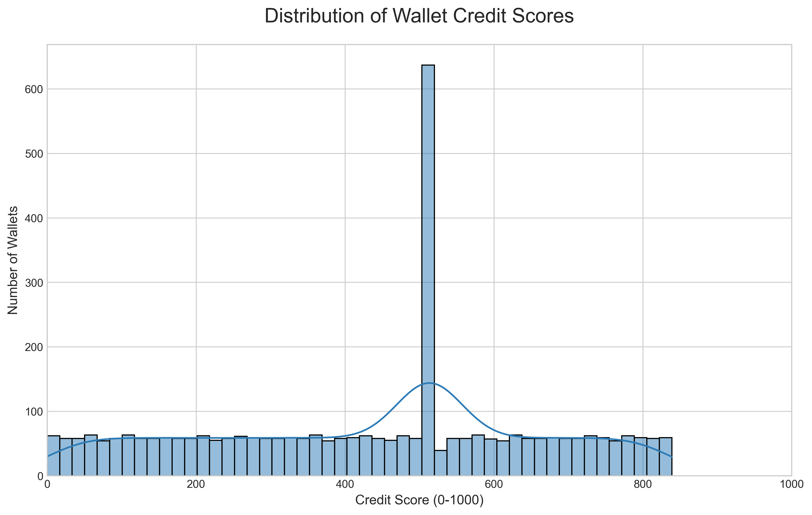

# Analysis of Wallet Credit Scores

This document provides an in-depth analysis of the credit scores generated by the model. We examine the overall score distribution and dive into the specific on-chain behaviors that characterize wallets at the high and low ends of the score spectrum.

---

## Score Distribution

The distribution of scores across all 3,497 wallets provides a high-level view of the Aave user base in this dataset.

The histogram reveals several key insights:

*   **A Healthy, Balanced Distribution:** The scores are not clustered at one end. Instead, they form a healthy distribution centered around the 400-500 range. This shows that the model is successfully differentiating wallets across the full spectrum of risk and reliability.
*   **A Core of Average Users:** The largest concentration of users falls in the middle range, representing the "average" Aave user who engages in standard deposit and borrow activities without exhibiting extremely safe or extremely risky behavior.
*   **Tails of Risk and Reliability:** The distribution has clear "tails." The left tail represents a smaller group of high-risk wallets that score very low (0-200), while the right tail represents the most trusted, high-scoring wallets (700+).

---

## Behavior of High-Scoring Wallets (Score > 700)

Wallets in the upper echelon of the scoring range are the pillars of the protocol. They are characterized by stability, significant liquidity provision, and responsible debt management.

**Dominant Features:**
*   **Long-Term History (`wallet_age_days`):** These wallets have often been active on the protocol for a long time, demonstrating commitment and experience.
*   **Net Liquidity Providers (`net_deposit_usd`):** Their total deposits significantly outweigh their redeems. They are crucial for supplying the capital that others borrow.
*   **Excellent Health (`mean_health_factor_proxy`):** When they do borrow, they maintain a very high health factor, indicating they are far from any risk of liquidation. They often use stablecoins as collateral to minimize volatility risk.
*   **Consistent Repayments (`repay_to_borrow_ratio`):** They reliably repay their loans, with a repayment value close to their total borrowed value.
*   **Zero Liquidations:** They have **never been liquidated**. This is a defining characteristic of a top-tier wallet.

**Example Behavior:** A typical high-scoring wallet might deposit a large sum of WETH or USDC, leave it for months to earn interest, and occasionally borrow a small amount of a stablecoin against it, repaying the loan promptly.

---

## Behavior of Low-Scoring Wallets (Score < 300)

Wallets at the bottom of the spectrum exhibit behaviors that are deemed risky, unstable, or exploitative by the model.

**Dominant Features:**
*   **History of Liquidation (`liquidation_count > 0`):** This is the single strongest penalty. Any wallet that has been liquidated is almost guaranteed to have a very low score.
*   **Brinkmanship with Health Factor (`min_health_factor_proxy`):** These wallets often let their health factor drop to dangerously low levels (e.g., below 1.2), indicating they are highly leveraged and close to being liquidated.
*   **High Leverage (`borrow_to_deposit_ratio`):** They tend to borrow an amount that is very close to the maximum allowed by their collateral, leaving little room for price fluctuations.
*   **High-Frequency / Bot-like Activity (`transaction_frequency`):** Some low-scoring wallets exhibit bot-like patterns, such as executing a borrow and a repay in very quick succession, potentially for arbitrage, which is considered non-standard user behavior in this credit context.
*   **Short History:** Many of these wallets are also very new, with little track record to prove their reliability.

**Example Behavior:** A low-scoring wallet might deposit a volatile asset, borrow the maximum possible amount of a stablecoin, get liquidated when their collateral value drops, and then abandon the protocol.